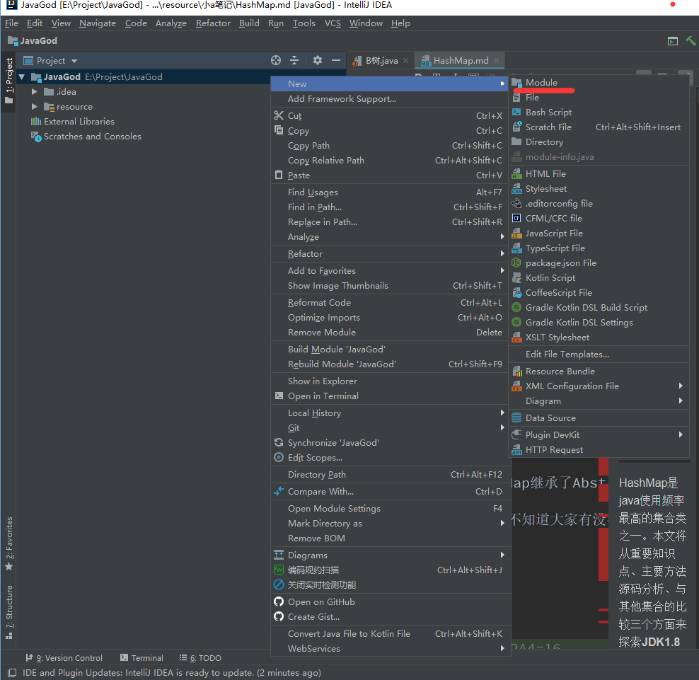
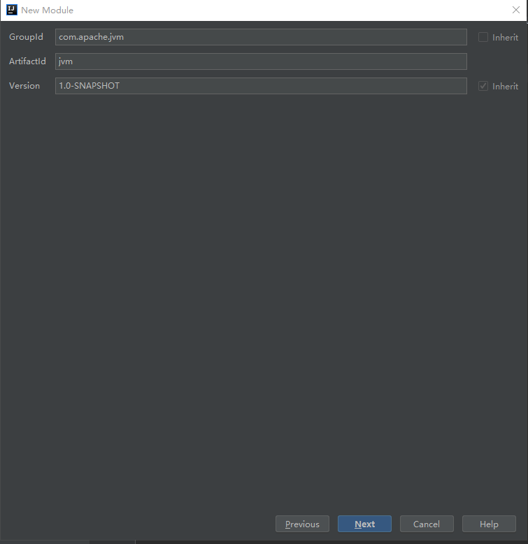

## 如何贡献知识

### 创建一个新的分类
因为每个分类可能运行的 Java 环境不同，所以我们使用Module将他
分割开来。
首先我们在JavaGod根目录创建一个Module

然后指定groupId 以及 artifact id

就可以创建一个新的分类了

### 为分类添加文档
你可以采取 JavaDoc 注释的方式在类文件内添加注释
也可以在你需要添加注释的模块的根目录下创建README.md 文件

### 注意
你需要保证你的代码一定要跑起来，因为只有能跑起来的代码才能
方便大家打断点调试。